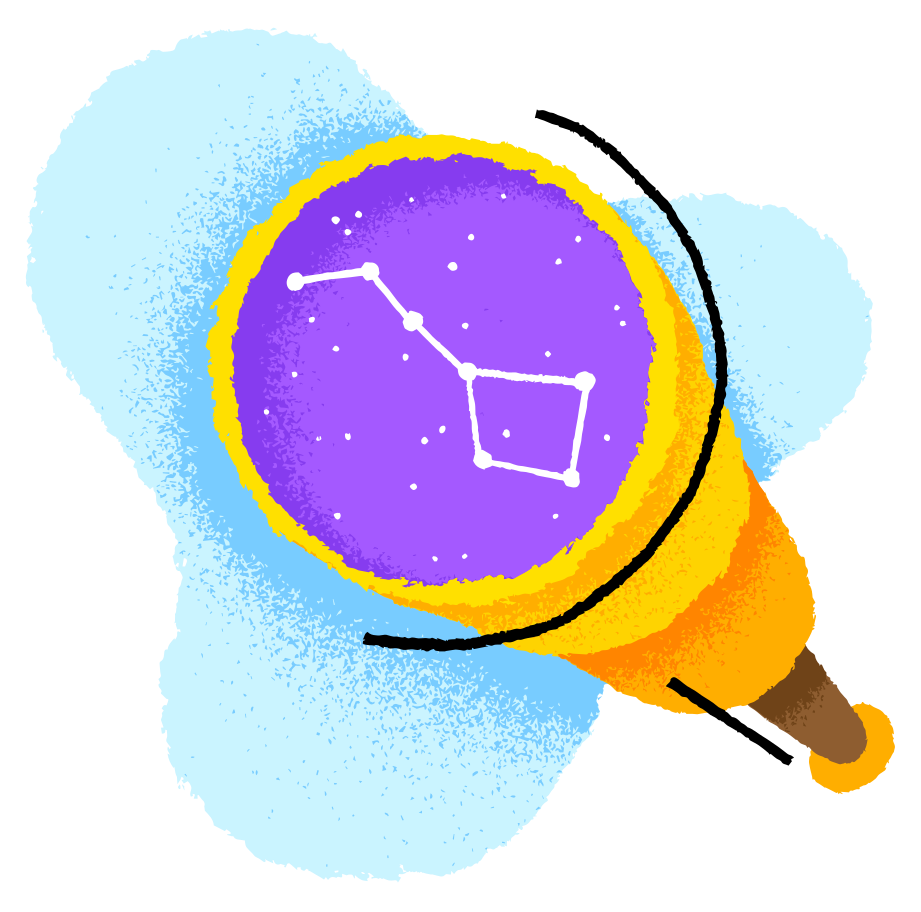

# <strong>Keyboard > Pen</strong>

## 👽 Greetings Fellow Developer!

Building tech is awesome and possibilites are endless, there's so much to be created! Nature can be fascinating as well, and that's why I enjoy going on walks in the countryside from time to time to clear my mind.

 

<i>"Perfectly balanced, as all things should be."</i> - <strong>An alien out there</strong>

 

## Keeping up with the industry is a must and that's why I always try to keep:

- 📖 Learning (Building the fundamentals).
- 🔍 Exploring (Leaving the comfort zone).
- 👻 Doing something (Something is better than nothing).

 

## Tech I use:

Here you can find some of the projects I have built.

###### Illustration by <a href="https://icons8.com/illustrations/author/5dd5075701d03600114d621f">Bogdan Magenta</a> from <a href="https://icons8.com/illustrations">Ouch!</a>
